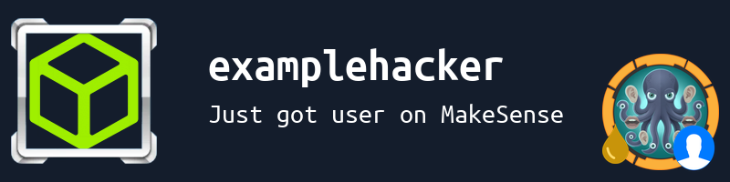
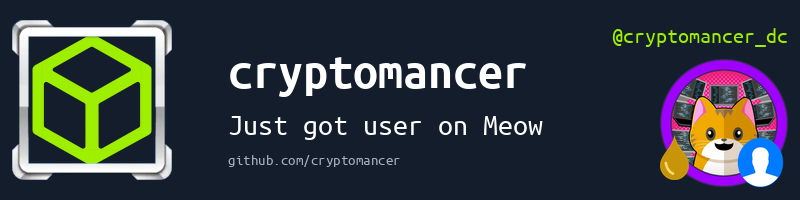
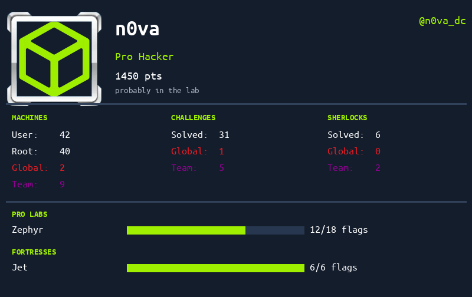
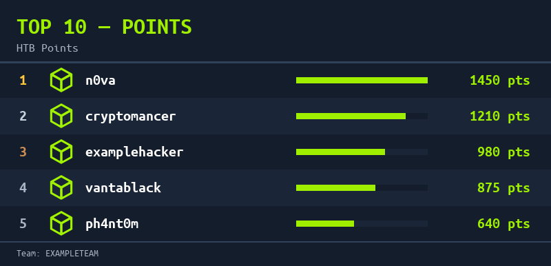

# ggasylum

A Discord bot that watches an [HackTheBox](https://hackthebox.com) team's activity
feed and posts live solve alerts, plus stats cards, leaderboards, and a
Discord-to-HTB account linking system.

## What it does

**Automatic solve alerts** -- polls the team's HTB activity feed and posts a
card to a configured channel every time someone roots a machine, gets a user
flag, or solves a challenge. Cards show a blood-drop indicator: red for a
global first blood, gold for a team-first on an active season machine,
purple for a team-first otherwise.

| Machine solve | Challenge solve |
|---|---|
|  |  |

If a member has linked their Discord account (see `!claim` below), their
card also shows their Discord handle and an optional short tag:

**`!stats`** -- posts a member's HTB stats card: rank, points, machine/
challenge/sherlock solve and blood counts, and any in-progress pro labs or
fortresses.

**`!leaderboard [points|bloods|season]`** -- posts a top-10 image ranked by
total points, team bloods in a rolling window, or team bloods on the current
season's machines.

**Discord ⇄ HTB account linking** -- members run `!claim <profileID|name>` to
request linking their Discord account to an HTB profile; an admin confirms it
with `!approve`. Once linked, a member can choose which avatar shows on their
cards (`!preference`) and set a short tag (`!tag`).

## Commands

| Command | Description | Role |
|---|---|---|
| `!ganggang` | gang gang | everyone |
| `!ping` | health check | everyone |
| `!stats [profileID\|name\|@mention]` | show a member's HTB stats card (default: yourself, if claimed) | everyone |
| `!leaderboard [points\|bloods\|season]` | top 10 leaderboard (default: points) | everyone |
| `!help` / `!help2` | list commands available to you | everyone |
| `!claim <profileID\|name>` | request to link your Discord account to one HTB profile | everyone |
| `!preference <htb\|discord>` | choose which avatar shows for you | everyone |
| `!tag <text>` | set a short tag shown on your `!stats` card | everyone |
| `!syncqueue` / `!syncstatus` | show poller/profile-sync worker status | admin |
| `!dbstats` | show DB row counts | admin |
| `!setchannel <channelID\|name>` | set the channel pwn alerts are posted to | admin |
| `!showstale <duration>` | list users with no activity in the given time | admin |
| `!claimqueue` | list pending claim requests | admin |
| `!approve <claimID>` / `!deny <claimID> [reason]` | resolve a pending claim | admin |
| `!addadmin` / `!removeadmin <@mention\|discordID>` | grant/revoke admin role | owner |
| `!showadmins` | list current admins | owner |
| `!trimcache` | remove orphaned cached avatar files | owner |
| `!purgeuser <profileID\|name>` | permanently delete a user and all their history | owner |
| `!testpwn` / `!andor` | testing utilities for the render pipeline / team-blood logic | owner |

## Running it

See [CONTRIBUTING.md](CONTRIBUTING.md) for a full walkthrough of setting up
your own bot token, test server, and HTB API token to run this against --
you'll need your own of each, since this repo's production credentials
aren't (and never will be) checked in.

## Contributing

Bug fixes and features are welcome. Branch off `main`, open a PR when ready,
and see [CONTRIBUTING.md](CONTRIBUTING.md) for the full setup and submission
process.

## License

See [LICENSE](LICENSE).
